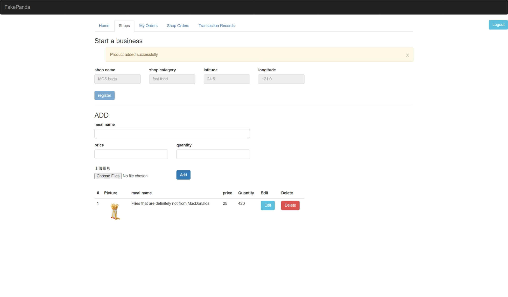

# Online-Food-Ordering-System



Online Food Ordering System Website using basic Python(Flask), SQL, HTML, JS & CSS. It has a food ordering module for a customer. It also provides menu and orders management module for admin.

Course project: Introduction to database by Jiun-Long Huang (NYCU 2022 Spring)

Team of 3: S.W. Li, P.C. Li, H.Y. Xu

## Features

* Home page
  * Register/Login
  * Search for products and stores by price, distance, food type, etc.
  * Add credit
  * View menu and order directly
* Shops page
  * Register as a shop owner
  * Manage products and inventory
* My Orders page
  * View all orders and details
  * Filter and sort orders
  * Batch cancel/refund orders
* Shop Orders page
  * View all orders and details for your store
  * Filter and sort orders
  * Batch finish/cancel/refund orders
* Transaction Records page
  * View all transaction records
  * Filter and sort records
* All operations are safe from SQL injection

## Usage

```bash
python app.py
```
